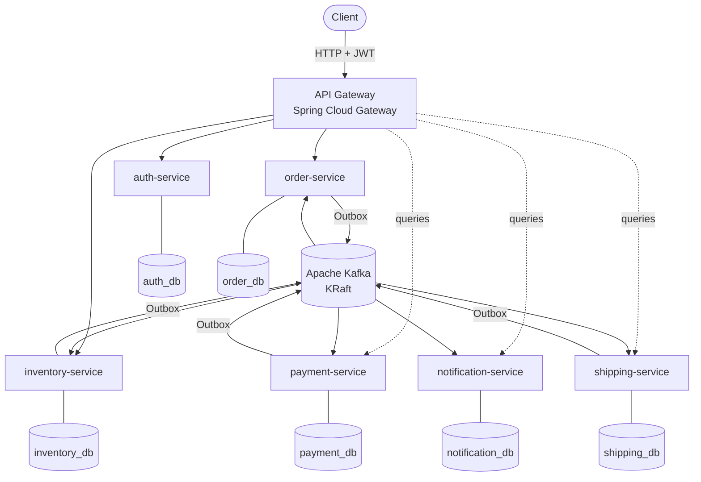
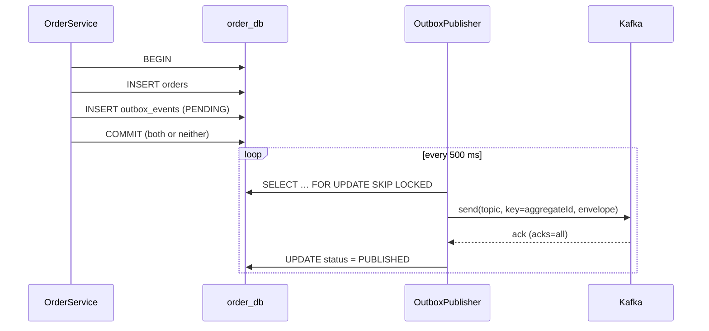
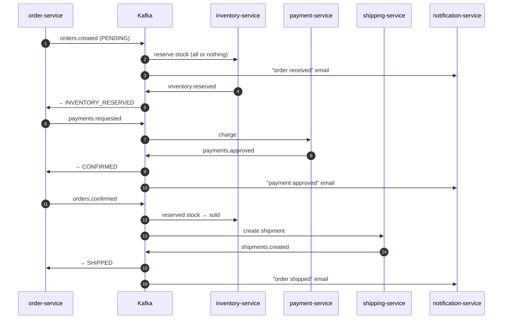
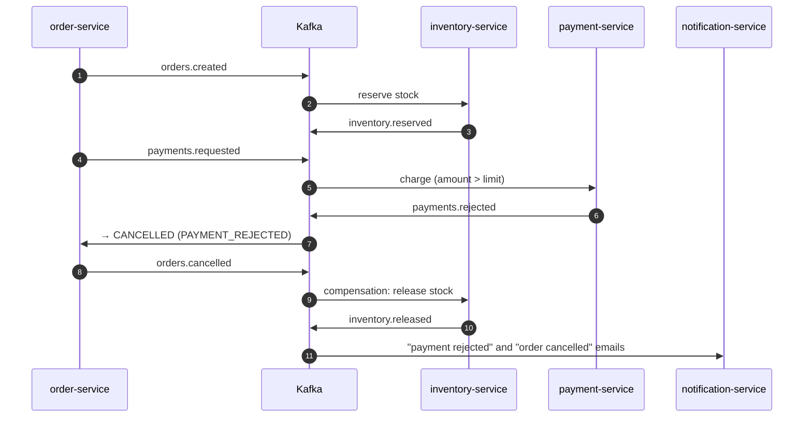

[🇪🇸 Español](README.md) | **🇬🇧 English**

# Event Driven Commerce

A distributed e-commerce platform built as **microservices** that communicate through **Apache Kafka**. Creating an order doesn't trigger a chain of REST calls: the order publishes an event and each service reacts on its own (stock reservation, payment, notification, shipping). The outcome is reached through **eventual consistency**, via a **choreographed saga** with compensations.

The project focuses on the real problems of distributed messaging: not losing events (**Transactional Outbox**), not processing them twice (**idempotent consumers**), not blocking a partition with a poison message (**retry + Dead Letter Topics**), keeping **per-order ordering**, undoing work without distributed transactions (**saga**) and following a request across the whole system (**correlation ID**).


---

## Contents

- [Architecture](#architecture)
- [Services](#services)
- [REST vs events](#rest-vs-events)
- [Kafka: topics, partitions and consumer groups](#kafka-topics-partitions-and-consumer-groups)
- [Event envelope and versioning](#event-envelope-and-versioning)
- [Outbox Pattern](#outbox-pattern)
- [Idempotency](#idempotency)
- [Retry and Dead Letter Topics](#retry-and-dead-letter-topics)
- [Saga and eventual consistency](#saga-and-eventual-consistency)
- [Ordering](#ordering)
- [Correlation ID and logs](#correlation-id-and-logs)
- [Transactions](#transactions)
- [Security](#security)
- [Running with Docker](#running-with-docker)
- [Trying the full flow](#trying-the-full-flow)
- [Kafka UI](#kafka-ui)
- [OpenAPI](#openapi)
- [Testing](#testing)
- [Architecture Decisions](#architecture-decisions)
- [Project structure](#project-structure)
- [Possible improvements](#possible-improvements)
- [Author](#author)
- [License](#license)

---

## Architecture



```text
                         ┌─────────────────────┐
                         │     API Gateway     │  routing · JWT · correlation ID · aggregated Swagger
                         └──────────┬──────────┘
                                    │ REST
                                    ▼
                         ┌─────────────────────┐
                         │    Order Service    │──── order_db (orders + outbox_events)
                         └──────────┬──────────┘
                                    │ Outbox Pattern
                                    ▼
                         ┌─────────────────────┐
                         │        Kafka        │  11 topics + 11 DLT · 3 partitions · key = orderId
                         └──────┬───┬───┬──────┘
                  ┌─────────────┘   │   └──────────────┐
                  ▼                 ▼                  ▼
          Inventory Service   Payment Service   Notification Service      Shipping Service
                  │                 │                  │                        │
             inventory_db       payment_db       notification_db           shipping_db
```

**Principles**

- **Each service owns its data.** One PostgreSQL database and user per service, and each user **can only connect to its own** (`REVOKE ALL ... FROM PUBLIC`). No service reads another's tables.
- **No REST calls between services.** All collaboration happens through events. REST is only the boundary with the client.
- **Every service follows the same structure:** Controller → Service → Repository/Entity, DTOs, a Kafka listener that only translates the message, error handling and its own configuration.
- **Shared infrastructure lives in shared libraries**, not duplicated in each service:
  - `commerce-events` defines the event contract, with no Spring dependencies.
  - `commerce-platform` groups the outbox, idempotency, retry/DLT, JWT, correlation ID, REST errors and OpenAPI.
  - `commerce-testing` holds the test support.

## Services

| Service | Internal port | Responsibility | Publishes | Consumes |
|---|---|---|---|---|
| **api-gateway** | 8080 (public) | Routing, JWT at the edge, correlation ID, aggregated Swagger. No business logic | — | — |
| **auth-service** | 8085 | Users, sign-up, login, JWT issuing, initial administrator | — | — |
| **order-service** | 8081 | Orders, central saga participant, local catalog replica | `orders.created`, `payments.requested`, `orders.confirmed`, `orders.cancelled` | `inventory.*`, `payments.approved/rejected`, `shipments.created`, `products.changed` |
| **inventory-service** | 8082 | Catalog and stock: reserve, release and confirm | `inventory.reserved/failed/released`, `products.changed` | `orders.created/confirmed/cancelled` |
| **payment-service** | 8083 | Charging with a simulated `PaymentProcessor`; refund on cancellation | `payments.approved/rejected` | `payments.requested`, `orders.cancelled` |
| **notification-service** | 8084 | Simulated customer emails (`ORDER_CREATED`, `PAYMENT_APPROVED`, `PAYMENT_REJECTED`, `ORDER_CANCELLED`, `ORDER_SHIPPED`) | — | `orders.created/cancelled`, `payments.approved/rejected`, `shipments.created` |
| **shipping-service** | 8086 | Creates the shipment once the order is confirmed | `shipments.created` | `orders.confirmed`, `orders.cancelled` |

**Main endpoints** (all through the gateway at `http://localhost:8080`):

| Method | Route | Role | Description |
|---|---|---|---|
| POST | `/api/v1/auth/register` · `/login` | public | Sign-up and JWT issuing |
| POST | `/api/v1/orders` | USER | Creates the order (**202 Accepted**, `PENDING` status) |
| GET | `/api/v1/orders` · `/api/v1/orders/{id}` | USER / ADMIN | Own orders (USER) or all (ADMIN); someone else's order responds 404 |
| PATCH | `/api/v1/orders/{id}/cancel` | USER / ADMIN | Cancels before shipping (publishes `ORDER_CANCELLED`) |
| POST · PUT · GET | `/api/v1/products[/{id}]` | ADMIN (write) · USER (read) | Catalog; every change publishes `PRODUCT_CHANGED` |
| GET · POST | `/api/v1/inventory/{productId}[/add]` | ADMIN | View and restock |
| GET | `/api/v1/payments/{orderId}` · `/api/v1/shipments/{orderId}` · `/api/v1/notifications?orderId=` | ADMIN | View the outcome of each saga step |

## REST vs events

```text
REST (synchronous, client ↔ system)           Events (asynchronous, service ↔ service)

Client                                         Order Service
  ↓                                              ↓  outbox
API Gateway                                    Kafka  ── orders.created ──┬── Inventory
  ↓                                                                        ├── Payment (via payments.requested)
Order Service  →  202 Accepted (PENDING)                                   └── Notification
```

`POST /api/v1/orders` responds **202 Accepted** with the order in `PENDING`: the API confirms it has recorded the request, not that the order is complete. The client polls `GET /api/v1/orders/{id}` until it sees `SHIPPED` or `CANCELLED`.

Order-service needs prices to value the order and, even so, **doesn't call inventory over REST**: it keeps a **local catalog replica** fed by the `products.changed` topic (*event-carried state transfer*). If inventory is down, orders are still accepted.

## Kafka: topics, partitions and consumer groups

### Topics

Names are centralized in `Topics` (the `commerce-events` library) and each event type declares its topic in `EventType`. No topic name is hand-written anywhere else in the code. Topics are declared by the services with `KafkaAdmin` (`auto.create.topics.enable=false`), so nothing gets created by accident with default settings.

| Topic | Event | Producer | Consumer groups | Key |
|---|---|---|---|---|
| `orders.created` | `ORDER_CREATED` | order | inventory, notification | orderId |
| `inventory.reserved` | `INVENTORY_RESERVED` | inventory | order | orderId |
| `inventory.failed` | `INVENTORY_RESERVATION_FAILED` | inventory | order | orderId |
| `inventory.released` | `INVENTORY_RELEASED` | inventory | — (audit) | orderId |
| `payments.requested` | `PAYMENT_REQUESTED` | order | payment | orderId |
| `payments.approved` | `PAYMENT_APPROVED` | payment | order, notification | orderId |
| `payments.rejected` | `PAYMENT_REJECTED` | payment | order, notification | orderId |
| `orders.confirmed` | `ORDER_CONFIRMED` | order | inventory, shipping | orderId |
| `orders.cancelled` | `ORDER_CANCELLED` | order | inventory, payment, shipping, notification | orderId |
| `shipments.created` | `SHIPMENT_CREATED` | shipping | order, notification | orderId |
| `products.changed` | `PRODUCT_CHANGED` | inventory | order | productId |
| `<topic>.DLT` | unprocessable messages | each consumer's error handler | manual review | the original one |

Each service publishes **only its own facts**.

### Consumer groups

Each service consumes with its own group: `order-service-group`, `inventory-service-group`, `payment-service-group`, `notification-service-group` and `shipping-service-group`.

```text
orders.cancelled ──► inventory-service-group     (releases the stock)
                 ├─► payment-service-group       (refunds if already charged)
                 ├─► shipping-service-group      (stops the shipment)
                 └─► notification-service-group  (notifies the customer)
```

A **consumer group** is a "logical reader" with its own **offsets**: each group receives **every** message of the topic, independently of the others. Within a group, however, each partition is assigned to **a single** consumer. That's why scaling `inventory-service` to several replicas splits the work instead of reserving stock twice. If one group falls behind (notification down), the others aren't affected: when it comes back, it resumes from its offset.

### Partitions, offsets and parallelism

- **Partition:** the unit of ordering and parallelism. A topic with N partitions supports up to N active consumers per group.
- **Offset:** a message's position within its partition. Each group stores the offset it has processed up to. Here offsets are committed **per record, after processing it** (`ack-mode: record`), which gives *at-least-once* delivery.
- **Ordering:** Kafka only guarantees order **within a partition**, never across partitions or topics.

**Why 3 partitions.** It's a deliberately modest value:

- It allows 3 parallel consumers per service (`spring.kafka.listener.concurrency=3`) and demonstrates the split between replicas.
- Adding partitions later **changes the target partition of existing keys** and breaks per-order ordering during the transition, so it shouldn't be oversized or changed lightly.
- More partitions cost more file descriptors, longer rebalances and more leader-election latency, which adds nothing with a single broker.

DLTs have **the same 3 partitions** to preserve the message's original partition. Everything is configurable (`KAFKA_TOPIC_PARTITIONS`).

## Event envelope and versioning

Every event shares the same structure (`EventEnvelope<T>`):

```json
{
  "eventId": "5b0f6a5e-1c7e-4a39-9c43-2f5d8e9b7a10",
  "eventType": "ORDER_CREATED",
  "eventVersion": 1,
  "occurredAt": "2026-09-23T10:00:00Z",
  "aggregateType": "Order",
  "aggregateId": "42",
  "correlationId": "abc-123",
  "source": "order-service",
  "payload": {
    "orderId": 42,
    "userId": 7,
    "items": [{ "productId": 1, "productName": "Keyboard", "quantity": 2, "unitPrice": 89.90 }],
    "totalAmount": 179.80
  }
}
```

| Field | What it's for |
|---|---|
| `eventId` | The consumers' **idempotency** key; also the outbox row id |
| `eventType` + `eventVersion` | Explicit contract; the consumer rejects versions it doesn't know |
| `aggregateId` | Kafka key → per-order ordering |
| `correlationId` | Following a whole saga across services |
| `source` | Which service published the event |

**Schema evolution.** Payloads are `record`s validated with Bean Validation and registered in `EventType`.

- **Compatible change** (adding an optional field): keeps the version. Consumers ignore unknown fields, so a new producer doesn't break an old one.
- **Breaking change:** bumps `eventVersion`. An old consumer doesn't try to interpret a schema it doesn't understand: the `EventReader` throws `InvalidEventException` and the message goes to the **DLT**, instead of being silently mishandled.

Metadata such as `eventId`, `eventType` and `correlationId` also travels in **Kafka headers**, to filter and debug in Kafka UI without opening the body.

## Outbox Pattern

**The problem.** Saving the order and publishing to Kafka are two different systems:

```text
order COMMIT       OK
publish to Kafka   FAILS      →  the order exists, but the event was lost: the saga never starts
```

Reversing the order doesn't work either: the event would go out even if the transaction rolled back.

**The solution.** The event is stored **in the same database and in the same transaction** as the business change, and a separate process publishes it:



**`outbox_events` table:**

- `id` (= eventId), `position` (insertion order), `aggregate_type`, `aggregate_id`, `event_type`, `topic`, `payload`, `correlation_id`.
- `status` (`PENDING` / `PUBLISHED` / `FAILED`), `retry_count`, `next_attempt_at`, `created_at`, `published_at` and `last_error`.

**Implementation details** (`commerce-platform/outbox`):

- `OutboxWriter` **requires an active transaction**: writing to the outbox outside a transaction throws an exception.
- **Per-aggregate ordering.** Only the *head* of each aggregate is published: an event doesn't go out while an earlier one for the same order remains unpublished. The `NOT EXISTS` on `position` guarantees it even with retries and with **several instances** of the service (`FOR UPDATE SKIP LOCKED` prevents two instances from publishing the same row).
- **Bounded retries.** If Kafka doesn't respond, the event stays `PENDING` with **exponential backoff** (2 s, 4 s…). After **3 attempts** it moves to `FAILED`: it isn't lost, it's recorded with `last_error` and it blocks that order's later events so they aren't reordered. It's re-queued manually once the cause is fixed (`UPDATE outbox_events SET status='PENDING', retry_count=0 WHERE status='FAILED'`).
- **Audit.** `PUBLISHED` events **aren't deleted** when published: they're kept for 7 days (`commerce.outbox.retention`) and purged by a daily job.
- **Metrics.** The `outbox.events{status}` gauge in `/actuator/metrics` shows how many events are in each state. A growing `PENDING` means Kafka is unavailable; a `FAILED` needs attention.
- **Guarantee: *at-least-once*.** If the service crashes between Kafka's ack and the `UPDATE` to `PUBLISHED`, the event is published twice. That's why consumers are idempotent.

Every publishing service uses the outbox (order, inventory, payment, shipping). No service calls `KafkaTemplate.send()` from its business logic.

## Idempotency

Kafka + outbox deliver *at-least-once*, so duplicates are normal: outbox resends, retries after a failure or group rebalances. Each consumer must produce **the same effect** whether it receives an event once or several times.

```text
BEGIN
  INSERT INTO processed_events (consumer, event_id) … ON CONFLICT DO NOTHING
     ├── 0 rows → already processed: ignored
     └── 1 row  → handler: business changes + outgoing events in the outbox
COMMIT
```

- The **`processed_events`** table (`consumer`, `event_id`, `processed_at`) has the primary key `(consumer, event_id)`. The same event is processed independently by several consumers (e.g. inventory and notification).
- **The record, the effects and the outgoing events are atomic.** If the handler fails, the rollback also undoes the record and the retry processes the event again. There's no "marked as processed but without effect" case.
- **Concurrency-safe.** If two threads or instances process the same event at once, the second `INSERT` **waits on the unique index**. When the first commits, the second inserts 0 rows and discards it; if the first rolls back, the second processes it. Tested with 2 and 3 simultaneous threads (`concurrentDeliveriesOfTheSameEventHaveASingleEffect`, `concurrentDuplicatesSendASingleNotification`).
- **A second barrier in the data model.** There are business unique indexes: one reservation, one payment and one shipment per order, and one notification per event and type.

The platform wraps it in `IdempotentEventProcessor`, so each listener is a single line:

```java
@KafkaListener(topics = Topics.ORDERS_CREATED)
public void onOrderCreated(ConsumerRecord<String, String> record) {
    processor.handle(record, EventType.ORDER_CREATED, "reserve-stock", reservations::reserve);
}
```

## Retry and Dead Letter Topics

A message that can't be processed must not block its partition or be retried forever. The configuration lives in `KafkaErrorHandling`, with `DefaultErrorHandler` and `DeadLetterPublishingRecoverer`:

```text
payments.requested ──► transient error ──► retry 1 (100 ms…) ──► 2 ──► 3 ──► payments.requested.DLT
                  └──► permanent error ─────────────────────────────────────► payments.requested.DLT
```

| Error type | Examples | Strategy |
|---|---|---|
| **Transient** | Payment gateway down (`PaymentGatewayUnavailableException`), DB timeout, optimistic lock conflict | **Retry** with exponential backoff: 3 retries (500 ms → 1 s → 2 s, 5 s max). If it persists → DLT |
| **Permanent / schema** | Unreadable JSON, unexpected `eventType`, unknown version, invalid payload (`InvalidEventException`) | **No retry** → immediate DLT: retrying wouldn't change the outcome |
| **Inconsistent business** | Event for an order that doesn't exist (`NonRetryableEventException`) | **No retry** → DLT |
| **Expected business** | Out of stock, payment rejected | **Not an error**: modeled as an event (`INVENTORY_RESERVATION_FAILED`, `PAYMENT_REJECTED`) and the saga compensates |
| **Kafka unavailable when publishing** | Broker down | Absorbed by the **outbox**: the event stays `PENDING` and is retried with backoff (see above) |

- The DLT message keeps its **partition, key and headers**, and Spring Kafka adds diagnostic headers (`kafka_dlt-exception-cause-fqcn`, `kafka_dlt-exception-message`, original topic and offset).
- Retries are **in-memory and blocking** for that partition, which is right for short waits and preserves ordering. Minute-long waits would use non-blocking *retry topics*, mentioned under [improvements](#possible-improvements).
- **To see it live:** start with `PAYMENT_TRANSIENT_FAILURE_RATE=1.0` and create an order. The payment logs show the 4 attempts, and Kafka UI shows the message in `payments.requested.DLT`.

## Saga and eventual consistency

There's no distributed transaction (2PC/XA) across the six databases. Each service commits its **local transaction** and publishes a fact, and the others react. If a step fails, the earlier steps are **compensated** with new events.

The saga is a **choreography**: there's no central orchestrator and each service knows which facts it reacts to. Order-service acts as the main participant because it owns the order's state.

### Happy path



### Compensation: payment rejected



Order created → stock reserved → payment rejected → stock released → order cancelled. Verified end to end in `SagaEndToEndTest.rejectedPaymentCancelsTheOrderAndReleasesTheStock`, with the real services in Docker.

### Order states

```text
PENDING ──inventory.reserved──► INVENTORY_RESERVED ──payments.approved──► CONFIRMED ──shipments.created──► SHIPPED
   │                                   │                                      │
   ├── inventory.failed ───────────────┤◄── payments.rejected                 │
   └────────────── customer cancellation ──────────► CANCELLED ◄──────────────┘
```

### What eventual consistency means here

- For a few milliseconds or seconds, a `PENDING` order can already have its stock reserved in inventory while order doesn't know it yet. The system is **consistent in the end**, not at every instant. The API communicates this with 202 and an explicit status.
- **Events can arrive in a different order** than the causal one when they're on different topics: for example, `orders.cancelled` before `orders.created` for the same order. Each participant handles it with **markers**: if a cancellation arrives for an order it doesn't know, it stores a `VOIDED` record, and a late `ORDER_CREATED` or `PAYMENT_REQUESTED` no longer reserves or charges. Tested in `cancellationArrivingBeforeCreationPreventsTheLateReservation` and `cancellationBeforeTheRequestPreventsTheLateCharge`.
- **Late events are ignored** if the order is no longer in the expected state. For example, a payment approved after the customer cancelled doesn't confirm the order: payment will already have **refunded** when it received `ORDER_CANCELLED`.
- **Concurrency on the same order.** When the customer cancels while the payment confirmation arrives, the `@Version` on `Order` (optimistic locking) makes one of the two transactions fail. If it was the listener, it's retried with the updated state; if it was the REST request, it responds 409.

## Ordering

**Message key = `orderId`.** Kafka assigns the partition with a hash of the key, so every event of the same order goes to the **same partition** and is consumed **in the order it was published**, by a single consumer of the group at a time. Without a key, `orders.confirmed` and `orders.cancelled` for the same order could be processed in parallel on different consumers, in any order.

The full ordering chain is:

1. The **outbox** publishes in `position` order and never lets an event overtake an earlier one of the same order.
2. The **idempotent producer** (`enable.idempotence=true`, `acks=all`) prevents the client's internal retries from duplicating or reordering messages within the partition.
3. The **consumer** processes each partition sequentially, and retries are blocking, so a message can't overtake one that's being retried.

**Limits the design explicitly assumes:**

- Order **across topics** isn't guaranteed; that's covered by the `VOIDED` markers and state checks.
- Product events use `productId` as the key, and the replica also discards events older than the applied state (`updatedAt`).

## Correlation ID and logs

The correlation ID is born at the **gateway**: the client's `X-Correlation-ID` is kept if valid and, if not, one is generated. From there it travels:

```text
HTTP (X-Correlation-ID) → service MDC → EventEnvelope.correlationId + Kafka header
      → consumer restores it in the MDC → the events it publishes inherit the same value → …
```

Every event of an order carries the same `correlationId`, from `ORDER_CREATED` to `SHIPMENT_CREATED`, even though different services publish them. The E2E test verifies it by reading every topic.

**Log format**, shared by every service (SLF4J + MDC):

```text
INFO [inventory-service] [cid:abc-123] [event:ORDER_CREATED id:5b0f… aggregate:42] … Stock reserved orderId=42 lines=2
INFO [order-service]     [cid:abc-123] [event:PAYMENT_APPROVED id:9c1e… aggregate:42] … Order confirmed orderId=42 userId=7
```

Passwords, JWTs, the `Authorization` header and secrets are never logged: the `toString()` of sensitive DTOs omits them.

## Transactions

| Operation | What is transactional | Mechanism |
|---|---|---|
| Creating, cancelling or changing an order's status | Business change + outgoing event | **Local** PostgreSQL transaction (`Order` + `outbox_events`) |
| Processing an event | Record in `processed_events` + business changes + outgoing events | **Local** transaction (*transactional inbox + outbox* pattern) |
| Reserving stock for several lines | All lines or none | Atomic `UPDATE … WHERE available >= :q`; if one fails, the earlier ones are returned in the same transaction |
| Whole saga | **Nothing**: it's several local transactions | Eventual consistency + compensations |

### Kafka transactions: evaluated and deliberately not used

Kafka offers transactions (`transactional.id`, `KafkaTransactionManager`) that make **a set of Kafka writes atomic**, together with the offset commit, in *consume-transform-produce* flows. They were evaluated here and deliberately left out, because every operation in this system writes to PostgreSQL first:

- **What a Kafka transaction guarantees:** that several messages and the consumed offset are committed together or not at all. Consumers with `isolation.level=read_committed` don't see aborted messages.
- **What it does NOT guarantee:** atomicity with the **database**. A Kafka transaction and a PostgreSQL one can't be committed together (there's no 2PC). Synchronizing them is *best effort*: there's always a window where one commits and the other doesn't. Nor does it prevent duplicated external effects, such as an email or a charge.
- **What is used instead:** the outbox makes the event depend on the DB transaction, and idempotency by `eventId` absorbs duplicates. The practical result is **exactly-once effects** with simpler guarantees that are easier to reason about.
- **What is enabled:** the **idempotent producer** (`enable.idempotence=true`, `acks=all`), which prevents duplicates and reordering from the client's own retries, and `isolation.level=read_committed` on consumers, which costs nothing and keeps the system ready for transactional producers.
- **Where they would help:** in a *stateless* service that only transforms messages from one topic to another, with no database (enrichment or routing). None of the current services fits that case.

## Security

- **auth-service** issues HS256 JWTs with `sub` (user id), `email` and `role` (`USER` / `ADMIN`).
- **Defense in depth.** The **gateway** rejects traffic without a valid token at the edge with 401, and **every service validates the token again** (the platform's `JwtAuthenticationFilter`) and applies its own role and ownership rules. A service never relies solely on the gateway having checked the token.
- **Rules:**
  - USER: create, view and cancel orders. Someone else's order responds **404** (it doesn't reveal which ids exist).
  - ADMIN: all orders, catalog management, stock, payments, shipments, notifications and Actuator metrics.
- **Other measures:**
  - Passwords with BCrypt.
  - Login responds the same and takes the same time if the email doesn't exist (BCrypt against a dummy hash), so users can't be enumerated.
  - CSRF disabled with justification (stateless API with Bearer, no cookies).
  - Secrets only arrive through environment variables.

## Running with Docker

Requirements: **Docker** with Docker Compose. Java 21 is only needed to run the tests; the Maven Wrapper is included.

```bash
git clone https://github.com/samsenpro/event-driven-commerce.git
cd event-driven-commerce
cp .env.example .env          # change the passwords and JWT_SECRET (openssl rand -base64 48)
docker compose up --build
```

| Component | URL |
|---|---|
| API Gateway | http://localhost:8080 |
| Swagger UI (every service) | http://localhost:8080/swagger-ui.html |
| Kafka UI | http://localhost:8090 |
| Kafka (from the host) | `localhost:9094` |
| PostgreSQL (from the host) | `localhost:5432` |

Docker Compose starts PostgreSQL (one DB per service), **Kafka 3.9 in KRaft mode** (no Zookeeper: the broker also acts as controller), Kafka UI, the 6 services and the gateway.

- Each service has a **Docker health check** on `/actuator/health/readiness`.
- The gateway doesn't start until every service is *healthy*, and the services wait for PostgreSQL and Kafka to be healthy.

**Configuration.** Each service has `application.yml`, `application-local.yml` and `application-docker.yml` profiles, plus environment variables. No hosts, ports, credentials or URLs are hard-coded. The main variables are documented in [`.env.example`](.env.example).

## Trying the full flow

With the stack running:

```bash
# 1. Log in as administrator (ADMIN_EMAIL / ADMIN_PASSWORD from .env) and add a product
ADMIN=$(curl -s localhost:8080/api/v1/auth/login -H 'Content-Type: application/json' \
  -d '{"email":"admin@demo.local","password":"ChangeMe123"}' | jq -r .accessToken)
curl -s localhost:8080/api/v1/products -H "Authorization: Bearer $ADMIN" -H 'Content-Type: application/json' \
  -d '{"sku":"KB-001","name":"Keyboard","price":89.90,"initialStock":10}'

# 2. Customer: sign-up, login and order
curl -s localhost:8080/api/v1/auth/register -H 'Content-Type: application/json' \
  -d '{"name":"Jane","email":"jane@example.com","password":"Password123"}'
USER=$(curl -s localhost:8080/api/v1/auth/login -H 'Content-Type: application/json' \
  -d '{"email":"jane@example.com","password":"Password123"}' | jq -r .accessToken)
curl -s localhost:8080/api/v1/orders -H "Authorization: Bearer $USER" -H 'Content-Type: application/json' \
  -H 'X-Correlation-ID: demo-1' -d '{"items":[{"productId":1,"quantity":2}]}'

# 3. Watch the saga progress: PENDING → INVENTORY_RESERVED → CONFIRMED → SHIPPED
curl -s localhost:8080/api/v1/orders/1 -H "Authorization: Bearer $USER" | jq .status
```

- **Compensation:** an order above 1000 (`PAYMENT_APPROVAL_LIMIT`) ends `CANCELLED` with `PAYMENT_REJECTED`, and its stock becomes available again.
- **Retry and DLT:** restart payment with `PAYMENT_TRANSIENT_FAILURE_RATE=1.0`.
- **An order's whole history:** in Kafka UI, filter by the key or by the `correlationId=demo-1` header.

**End-to-end tests** (with the stack running):

```bash
E2E_BASE_URL=http://localhost:8080 E2E_KAFKA_BOOTSTRAP=localhost:9094 \
E2E_ADMIN_EMAIL=admin@demo.local E2E_ADMIN_PASSWORD=ChangeMe123 \
./mvnw -Pe2e test -pl e2e-tests
```

## Kafka UI

At **http://localhost:8090** (cluster `event-driven-commerce`) you can see:

- **Topics:** the 11 business topics and their 11 DLTs, with 3 partitions each.
- **Messages:** each event's JSON envelope and its headers (`eventId`, `eventType`, `correlationId`). You can filter by key (orderId).
- **Consumers:** the 5 consumer groups, which partition each consumer has, their **offsets** and their **lag**. If you stop a service, its lag grows while the other groups stay up to date.
- **DLT:** the original message, along with the `kafka_dlt-*` headers that explain why it failed.

## OpenAPI

- Each service publishes its specification at `/v3/api-docs`, with **Bearer JWT** authentication, request examples on the DTOs and **error** examples (400, 401, 403, 404, 409, 422 and 500) added to every operation.
- The **gateway aggregates** the six specifications into a single Swagger UI (**http://localhost:8080/swagger-ui.html**, dropdown at the top right).
- "Try it out" goes through the gateway:
  1. Log in on *Auth Service*.
  2. Click **Authorize** and paste the token.
  3. Try any service.

Shared error format:

```json
{
  "timestamp": "2026-09-23T20:00:00Z",
  "status": 404,
  "error": "NOT_FOUND",
  "message": "Order not found: 42",
  "path": "/api/v1/orders/42",
  "correlationId": "abc-123"
}
```

## Testing

```bash
./mvnw verify        # unit + integration (needs Docker for Testcontainers)
```

- **Integration with real infrastructure.** Each service starts **real PostgreSQL and Kafka with Testcontainers**: no H2 or embedded Kafka.
- **Isolated services.** Each service is tested alone, publishing to Kafka the events the others would emit (`EventSender`) and reading what it publishes (`TopicProbe`).
- **Separate contexts.** Each class has its own Spring context. If two contexts shared a consumer group, a message could be processed in another test's context.

| Area | What is tested | Where |
|---|---|---|
| **Producer → Kafka** | Order created → outbox row → published on `orders.created` with key, headers, version and correlation ID | `OrderCreationIntegrationTest` |
| **Kafka → consumer** | Each service processes its events and publishes its own | Each service's `*IntegrationTest` |
| **Outbox** | Joint commit; **rollback** if the order or the outbox fails; writing outside a transaction is forbidden | `OutboxAtomicityIntegrationTest` |
| **Kafka down** | `PENDING` event with backoff → `FAILED` after 3 attempts → published on recovery; per-aggregate ordering | `OutboxPublisherIntegrationTest` |
| **Idempotency** | Duplicate event ignored; **same event processed at once by 2 and 3 threads** → a single effect | `ReservationIntegrationTest`, `NotificationIntegrationTest`, `OrderSagaIntegrationTest` |
| **Retry → DLT** | Persistent transient failure → **4 attempts** → `payments.requested.DLT`; failure then success → approved without DLT | `PaymentRetryIntegrationTest` |
| **Invalid schema → DLT** | Unreadable JSON, unknown version, missing order → DLT **without retries** | `DeadLetterIntegrationTest`, `EventReaderTest` |
| **Saga** | Success (reserved → paid → confirmed → shipped), compensation (payment rejected → cancelled), out of stock, late event after cancellation | `OrderSagaIntegrationTest`, `SagaEndToEndTest` |
| **Stock consistency** | All or nothing with several lines; orders competing for the last units; cancellation arriving before creation | `ReservationIntegrationTest` |
| **Security** | 401 without a token or with an invalid one (gateway and services), 403 by role, 404 for other users' orders | Gateway, order, inventory, payment |
| **Unit** | State machine, saga with Mockito, payment simulator, event contract, JWT, backoff | `OrderTest`, `OrderSagaServiceTest`, … |
| **E2E** | The three saga flows through the gateway with the real services and the correlation ID on every topic | `e2e-tests` (`e2e` profile) |

## Architecture Decisions

### Why Kafka?

Because the problem is a **flow of facts that interest several consumers**, and Kafka is a distributed, persistent *log*:

- **Several consumers read the same facts independently** (consumer groups), each at its own pace, and a new consumer can reprocess the history from the beginning.
- **Per-key ordering** with partitions: exactly what an order needs.
- **Retention:** if a service goes down, the events wait for it; there are no queues that empty on delivery.

A traditional queue broker distributes messages and deletes them once consumed. That's good for jobs (*tasks*), worse for events that several systems need to reprocess or audit.

### Why events?

With chained REST calls (order → inventory → payment → shipping), the system's availability is the **product** of all the services' and latency is the **sum** of them all. Also, order would have to know all its collaborators.

With events, order publishes "an order was created" and doesn't know who's listening. Adding an analytics or fraud service doesn't require touching order, and if notification is down orders keep working. The price is **eventual consistency**: complexity shifts from temporal coupling to handling duplicates, ordering and compensations, which is exactly what this project solves explicitly.

### Why the Outbox Pattern?

Because it's the simplest, most reliable way to make **"I changed my state" and "I told everyone" atomic** without distributed transactions. Publishing directly from the service loses events as soon as Kafka fails after the commit, or publishes events from transactions that later roll back. The outbox turns publishing into a **guaranteed** consequence of the commit, with retries, per-aggregate ordering and auditing included.

### Why idempotency?

Because in a distributed system end-to-end *exactly-once* delivery doesn't come for free: retries (from the outbox, the consumer or after a rebalance) can **always** duplicate messages. Instead of trying to prevent duplicates, the system **makes them harmless**: *at-least-once* delivery plus idempotent processing gives exactly-once **effects**. Without it, a retry could reserve stock or charge twice.

### Why a saga?

Because there's no transaction spanning six databases, and 2PC would couple every service's availability and doesn't fit Kafka. The saga splits the process into local transactions and defines what to do if a step fails (**compensate**: release stock, refund, cancel the shipment).

**Choreography** was chosen over orchestration because the flow is short and linear, and each participant has a clear reaction. With more steps, branches or business timeouts, an **orchestrator** (an explicit state machine) would be easier to follow; it's listed under [improvements](#possible-improvements).

### Why DLTs?

Because a message that can never be processed (a *poison pill*) would block its partition forever and stop every order that lands on it. The DLT **sets the message aside with its diagnosis** and lets processing continue, without losing it: it can be inspected in Kafka UI, the cause fixed and the message re-injected. Distinguishing transient errors (retry) from permanent ones (straight to DLT) avoids retrying what can't be fixed.

### Why consumer groups?

Because they provide **the two scaling dimensions** the system needs:

- **Across services:** each service has its group and receives **every** event (publish/subscribe).
- **Within a service:** replicas of the same group **split** the partitions (competing consumers).

Also, each group keeps its own offset, so a slow or down service doesn't affect the others.

### Why orderId as the Kafka key?

Because order matters **within an order** (confirmed before cancelled, reserved before released) and not between different orders. With `orderId` as the key, every event of an order goes to the same partition and is processed in order, one at a time. At the same time, different orders are spread across partitions and processed in parallel. It's the exact balance between ordering and parallelism the domain requires.

### Why eventual consistency?

Because the alternative, strong consistency across services, requires synchronous coordination: 2PC or distributed locks. That lowers availability and increases latency right on the critical path of a sale.

The business can perfectly tolerate an order spending a few moments in `PENDING`, as long as the final outcome is correct and it never sells stock that doesn't exist or charges without shipping. The latter is guaranteed **locally** in each service (atomic stock updates, unique indexes, idempotency) and **globally** by the saga and its compensations.

## Project structure

```text
event-driven-commerce/
├── libs/
│   ├── commerce-events/      # EventEnvelope, EventType (topic + version), Topics, payloads (records)
│   ├── commerce-platform/    # outbox, idempotency, retry/DLT, JWT, correlation ID, errors, OpenAPI
│   └── commerce-testing/     # test base with PostgreSQL + Kafka (Testcontainers), TopicProbe, EventSender
├── services/
│   ├── api-gateway/          # Spring Cloud Gateway (WebFlux)
│   ├── auth-service/
│   ├── order-service/        # controller · service (OrderService, OrderSagaService, CatalogReplicaService)
│   │                         # · messaging · repository · entity · dto · config · db/migration
│   ├── inventory-service/
│   ├── payment-service/
│   ├── notification-service/
│   └── shipping-service/
├── e2e-tests/                # full saga against docker compose (-Pe2e profile)
├── docker/postgres/          # creates one DB + user per service
├── docker-compose.yml
├── Dockerfile                # shared image parameterized per service (--build-arg SERVICE=…)
└── .env.example
```

Each service has its **own Flyway migrations** (`src/main/resources/db/migration`) on its own database, with JPA in `validate` mode.

## Possible improvements

- **Saga orchestrator** (a persisted state machine) if the flow grows in steps, branches or business timeouts (e.g. cancelling orders that have waited more than N minutes for payment).
- **Non-blocking retry topics** (`@RetryableTopic`) for long waits without stopping the partition.
- **Schema Registry** (Avro or Protobuf) with compatibility rules checked in CI, instead of manual JSON versioning.
- **CDC with Debezium** to read the outbox from the PostgreSQL WAL instead of *polling*.
- **DLT reprocessing** with a tool or an admin endpoint that re-injects corrected messages.
- **RS256/JWKS**: sign tokens with a private key in auth-service and validate them with the public one, so no other service can issue tokens.
- **Rate limiting and circuit breakers** on the gateway (Resilience4j).
- **Distributed observability**: OpenTelemetry traces connecting HTTP and Kafka, and Prometheus/Grafana metrics (lag per consumer group, outbox events, DLT).
- **3-broker Kafka cluster** with `replication.factor=3` and `min.insync.replicas=2` to survive a broker failure without losing acknowledged messages.
- **CI pipeline** (GitHub Actions) with integration tests, E2E on compose and dependency scanning.

## Author

- **LinkedIn:** [samuel-martinez-beleno](https://www.linkedin.com/in/samuel-martinez-beleno/)
- **GitHub:** [samsenpro](https://github.com/samsenpro)

## License

Distributed under the [MIT](LICENSE) license.
