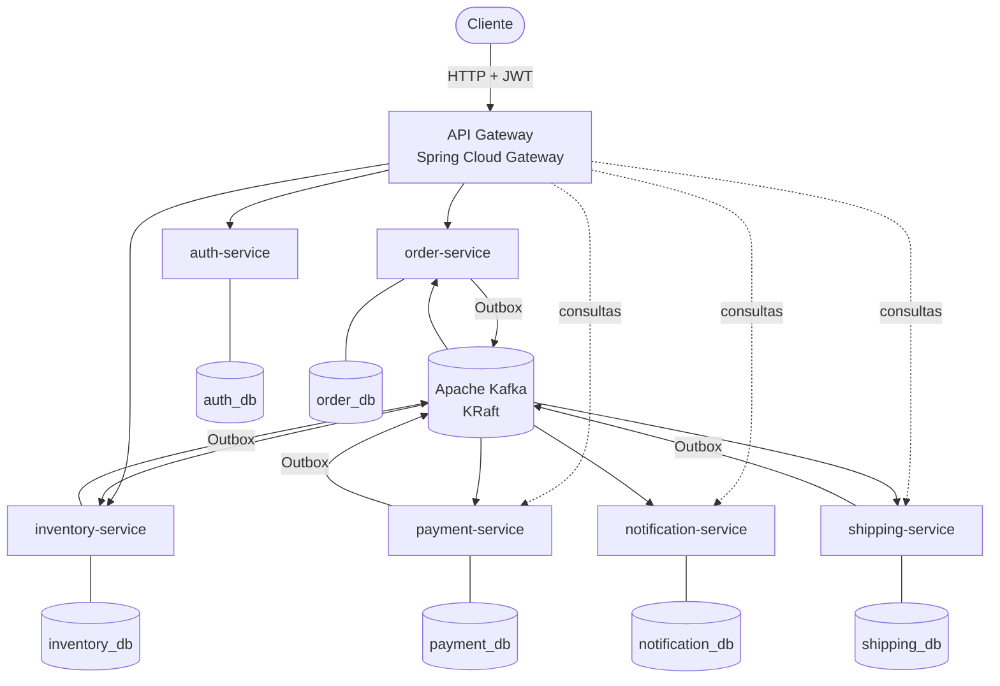
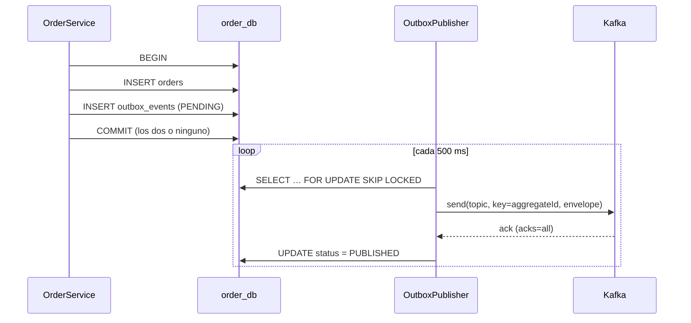
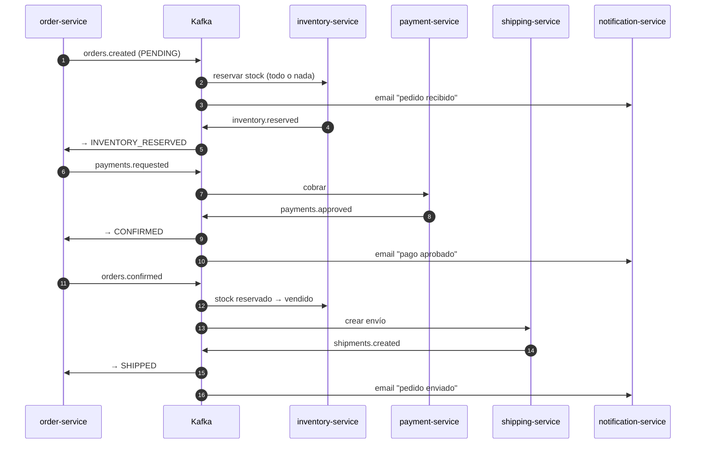
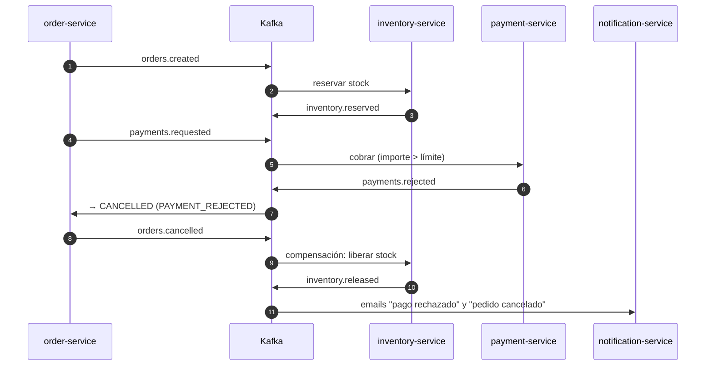

# Event Driven Commerce

Plataforma de e-commerce distribuida en **microservicios** que se comunican con **Apache Kafka**. Crear un pedido no desencadena una cadena de llamadas REST: el pedido publica un evento y cada servicio reacciona por su cuenta (reserva de stock, cobro, notificación, envío). El resultado se alcanza por **consistencia eventual**, mediante una **saga coreografiada** con compensaciones.

El proyecto se centra en los problemas reales de la mensajería distribuida: no perder eventos (**Transactional Outbox**), no procesarlos dos veces (**consumidores idempotentes**), no bloquear una partición con un mensaje venenoso (**retry + Dead Letter Topics**), mantener el **orden por pedido**, deshacer trabajo sin transacciones distribuidas (**saga**) y seguir una petición a través de todo el sistema (**correlation ID**).


---

## Índice

- [Arquitectura](#arquitectura)
- [Servicios](#servicios)
- [REST vs eventos](#rest-vs-eventos)
- [Kafka: topics, particiones y consumer groups](#kafka-topics-particiones-y-consumer-groups)
- [Event Envelope y versionado](#event-envelope-y-versionado)
- [Outbox Pattern](#outbox-pattern)
- [Idempotencia](#idempotencia)
- [Retry y Dead Letter Topics](#retry-y-dead-letter-topics)
- [Saga y consistencia eventual](#saga-y-consistencia-eventual)
- [Ordering](#ordering)
- [Correlation ID y logs](#correlation-id-y-logs)
- [Transacciones](#transacciones)
- [Seguridad](#seguridad)
- [Ejecutar con Docker](#ejecutar-con-docker)
- [Probar el flujo completo](#probar-el-flujo-completo)
- [Kafka UI](#kafka-ui)
- [OpenAPI](#openapi)
- [Testing](#testing)
- [Architecture Decisions](#architecture-decisions)
- [Estructura del proyecto](#estructura-del-proyecto)
- [Posibles mejoras](#posibles-mejoras)
- [Autor](#autor)
- [Licencia](#licencia)

---

## Arquitectura



```text
                         ┌─────────────────────┐
                         │     API Gateway     │  enrutado · JWT · correlation ID · Swagger agregado
                         └──────────┬──────────┘
                                    │ REST
                                    ▼
                         ┌─────────────────────┐
                         │    Order Service    │──── order_db (orders + outbox_events)
                         └──────────┬──────────┘
                                    │ Outbox Pattern
                                    ▼
                         ┌─────────────────────┐
                         │        Kafka        │  11 topics + 11 DLT · 3 particiones · key = orderId
                         └──────┬───┬───┬──────┘
                  ┌─────────────┘   │   └──────────────┐
                  ▼                 ▼                  ▼
          Inventory Service   Payment Service   Notification Service      Shipping Service
                  │                 │                  │                        │
             inventory_db       payment_db       notification_db           shipping_db
```

**Principios**

- **Cada servicio es dueño de sus datos.** Una base de datos y un usuario de PostgreSQL por servicio, y cada usuario **solo puede conectarse a la suya** (`REVOKE ALL ... FROM PUBLIC`). Ningún servicio lee tablas de otro.
- **Sin llamadas REST entre servicios.** Toda la colaboración ocurre por eventos. REST es solo la frontera con el cliente.
- **Cada servicio sigue la misma estructura:** Controller → Service → Repository/Entity, DTOs, un listener de Kafka que solo traduce el mensaje, manejo de errores y configuración propia.
- **La infraestructura común está en librerías compartidas**, sin duplicarse en cada servicio:
  - `commerce-events` define el contrato de eventos, sin dependencias de Spring.
  - `commerce-platform` agrupa el outbox, la idempotencia, retry/DLT, JWT, el correlation ID, los errores REST y OpenAPI.
  - `commerce-testing` reúne el soporte de tests.

## Servicios

| Servicio | Puerto interno | Responsabilidad | Publica | Consume |
|---|---|---|---|---|
| **api-gateway** | 8080 (público) | Enrutado, JWT en el borde, correlation ID, Swagger agregado. Sin lógica de negocio | — | — |
| **auth-service** | 8085 | Usuarios, registro, login, emisión de JWT, administrador inicial | — | — |
| **order-service** | 8081 | Pedidos, participante central de la saga, réplica local del catálogo | `orders.created`, `payments.requested`, `orders.confirmed`, `orders.cancelled` | `inventory.*`, `payments.approved/rejected`, `shipments.created`, `products.changed` |
| **inventory-service** | 8082 | Catálogo y stock: reservar, liberar y confirmar | `inventory.reserved/failed/released`, `products.changed` | `orders.created/confirmed/cancelled` |
| **payment-service** | 8083 | Cobro con un `PaymentProcessor` simulado; reembolso al cancelar | `payments.approved/rejected` | `payments.requested`, `orders.cancelled` |
| **notification-service** | 8084 | Emails simulados al cliente (`ORDER_CREATED`, `PAYMENT_APPROVED`, `PAYMENT_REJECTED`, `ORDER_CANCELLED`, `ORDER_SHIPPED`) | — | `orders.created/cancelled`, `payments.approved/rejected`, `shipments.created` |
| **shipping-service** | 8086 | Crea el envío cuando el pedido está confirmado | `shipments.created` | `orders.confirmed`, `orders.cancelled` |

**Endpoints principales** (todos a través del gateway en `http://localhost:8080`):

| Método | Ruta | Rol | Descripción |
|---|---|---|---|
| POST | `/api/v1/auth/register` · `/login` | público | Registro y obtención de JWT |
| POST | `/api/v1/orders` | USER | Crea el pedido (**202 Accepted**, estado `PENDING`) |
| GET | `/api/v1/orders` · `/api/v1/orders/{id}` | USER / ADMIN | Pedidos propios (USER) o todos (ADMIN); uno ajeno responde 404 |
| PATCH | `/api/v1/orders/{id}/cancel` | USER / ADMIN | Cancela antes del envío (publica `ORDER_CANCELLED`) |
| POST · PUT · GET | `/api/v1/products[/{id}]` | ADMIN (escribir) · USER (leer) | Catálogo; cada cambio publica `PRODUCT_CHANGED` |
| GET · POST | `/api/v1/inventory/{productId}[/add]` | ADMIN | Consultar y reponer stock |
| GET | `/api/v1/payments/{orderId}` · `/api/v1/shipments/{orderId}` · `/api/v1/notifications?orderId=` | ADMIN | Consultar el resultado de cada paso de la saga |

## REST vs eventos

```text
REST (síncrono, cliente ↔ sistema)            Eventos (asíncrono, servicio ↔ servicio)

Client                                         Order Service
  ↓                                              ↓  outbox
API Gateway                                    Kafka  ── orders.created ──┬── Inventory
  ↓                                                                        ├── Payment (vía payments.requested)
Order Service  →  202 Accepted (PENDING)                                   └── Notification
```

`POST /api/v1/orders` responde **202 Accepted** con el pedido en `PENDING`: la API confirma que ha registrado la petición, no que el pedido esté terminado. El cliente consulta `GET /api/v1/orders/{id}` hasta ver `SHIPPED` o `CANCELLED`.

Order-service necesita los precios para valorar el pedido y, aun así, **no llama a inventory por REST**: mantiene una **réplica local del catálogo** que alimenta el topic `products.changed` (*event-carried state transfer*). Si inventory está caído, se siguen aceptando pedidos.

## Kafka: topics, particiones y consumer groups

### Topics

Los nombres están centralizados en `Topics` (librería `commerce-events`) y cada tipo de evento declara su topic en `EventType`. Ningún nombre de topic está escrito a mano en el resto del código. Los topics los declaran los servicios con `KafkaAdmin` (`auto.create.topics.enable=false`), así que nada se crea por accidente con una configuración por defecto.

| Topic | Evento | Productor | Consumer groups | Clave |
|---|---|---|---|---|
| `orders.created` | `ORDER_CREATED` | order | inventory, notification | orderId |
| `inventory.reserved` | `INVENTORY_RESERVED` | inventory | order | orderId |
| `inventory.failed` | `INVENTORY_RESERVATION_FAILED` | inventory | order | orderId |
| `inventory.released` | `INVENTORY_RELEASED` | inventory | — (auditoría) | orderId |
| `payments.requested` | `PAYMENT_REQUESTED` | order | payment | orderId |
| `payments.approved` | `PAYMENT_APPROVED` | payment | order, notification | orderId |
| `payments.rejected` | `PAYMENT_REJECTED` | payment | order, notification | orderId |
| `orders.confirmed` | `ORDER_CONFIRMED` | order | inventory, shipping | orderId |
| `orders.cancelled` | `ORDER_CANCELLED` | order | inventory, payment, shipping, notification | orderId |
| `shipments.created` | `SHIPMENT_CREATED` | shipping | order, notification | orderId |
| `products.changed` | `PRODUCT_CHANGED` | inventory | order | productId |
| `<topic>.DLT` | mensajes no procesables | error handler de cada consumidor | revisión manual | la original |

Cada servicio publica **solo sus propios hechos**.

### Consumer groups

Cada servicio consume con su propio grupo: `order-service-group`, `inventory-service-group`, `payment-service-group`, `notification-service-group` y `shipping-service-group`.

```text
orders.cancelled ──► inventory-service-group     (libera el stock)
                 ├─► payment-service-group       (reembolsa si ya cobró)
                 ├─► shipping-service-group      (detiene el envío)
                 └─► notification-service-group  (avisa al cliente)
```

Un **consumer group** es un "lector lógico" con sus propios **offsets**: cada grupo recibe **todos** los mensajes del topic, independientemente de los demás. Dentro de un grupo, en cambio, cada partición se asigna a **un solo** consumidor. Por eso, al escalar `inventory-service` a varias réplicas, se reparten el trabajo en lugar de reservar stock dos veces. Si un grupo se retrasa (notification caído), los demás no se ven afectados: cuando vuelve, continúa desde su offset.

### Particiones, offsets y paralelismo

- **Partición:** unidad de orden y de paralelismo. Un topic con N particiones admite hasta N consumidores activos por grupo.
- **Offset:** posición de un mensaje dentro de su partición. Cada grupo guarda el offset hasta el que ha procesado. Aquí se hace commit **por registro, después de procesarlo** (`ack-mode: record`), lo que da entrega *at-least-once*.
- **Ordering:** Kafka solo garantiza el orden **dentro de una partición**, nunca entre particiones ni entre topics.

**Por qué 3 particiones.** Es un valor deliberadamente modesto:

- Permite 3 consumidores en paralelo por servicio (`spring.kafka.listener.concurrency=3`) y demostrar el reparto entre réplicas.
- Aumentar particiones más adelante **cambia la partición de destino de las claves existentes** y rompe el orden por pedido durante la transición, así que no se debe sobredimensionar ni cambiar a la ligera.
- Más particiones cuestan más descriptores de ficheros, más tiempo de rebalanceo y más latencia de elección de líder, algo que no aporta nada con un solo broker.

Los DLT tienen **las mismas 3 particiones** para conservar la partición original del mensaje. Todo es configurable (`KAFKA_TOPIC_PARTITIONS`).

## Event Envelope y versionado

Todos los eventos comparten la misma estructura (`EventEnvelope<T>`):

```json
{
  "eventId": "5b0f6a5e-1c7e-4a39-9c43-2f5d8e9b7a10",
  "eventType": "ORDER_CREATED",
  "eventVersion": 1,
  "occurredAt": "2026-09-23T10:00:00Z",
  "aggregateType": "Order",
  "aggregateId": "42",
  "correlationId": "abc-123",
  "source": "order-service",
  "payload": {
    "orderId": 42,
    "userId": 7,
    "items": [{ "productId": 1, "productName": "Keyboard", "quantity": 2, "unitPrice": 89.90 }],
    "totalAmount": 179.80
  }
}
```

| Campo | Para qué sirve |
|---|---|
| `eventId` | Clave de **idempotencia** de los consumidores; también es el id de la fila del outbox |
| `eventType` + `eventVersion` | Contrato explícito; el consumidor rechaza versiones que no conoce |
| `aggregateId` | Clave de Kafka → orden por pedido |
| `correlationId` | Seguir una saga completa entre servicios |
| `source` | Qué servicio publicó el evento |

**Evolución del esquema.** Los payloads son `record` validados con Bean Validation y registrados en `EventType`.

- **Cambio compatible** (añadir un campo opcional): mantiene la versión. Los consumidores ignoran los campos desconocidos, así que un productor nuevo no rompe a uno antiguo.
- **Cambio incompatible:** sube `eventVersion`. Un consumidor antiguo no intenta interpretar un esquema que no entiende: el `EventReader` lanza `InvalidEventException` y el mensaje va al **DLT**, en lugar de procesarse mal en silencio.

Metadata como `eventId`, `eventType` y `correlationId` viaja también en **cabeceras de Kafka**, para filtrar y depurar en Kafka UI sin abrir el cuerpo.

## Outbox Pattern

**El problema.** Guardar el pedido y publicar en Kafka son dos sistemas distintos:

```text
COMMIT del pedido  OK
publicar en Kafka  FALLA      →  el pedido existe, pero el evento se perdió: la saga nunca empieza
```

Invertir el orden tampoco sirve: el evento saldría aunque la transacción hiciera rollback.

**La solución.** El evento se guarda **en la misma base de datos y en la misma transacción** que el cambio de negocio, y un proceso aparte lo publica:



**Tabla `outbox_events`:**

- `id` (= eventId), `position` (orden de inserción), `aggregate_type`, `aggregate_id`, `event_type`, `topic`, `payload`, `correlation_id`.
- `status` (`PENDING` / `PUBLISHED` / `FAILED`), `retry_count`, `next_attempt_at`, `created_at`, `published_at` y `last_error`.

**Detalles de implementación** (`commerce-platform/outbox`):

- `OutboxWriter` **exige una transacción activa**: escribir en el outbox fuera de una transacción lanza una excepción.
- **Orden por agregado.** Solo se publica la *cabeza* de cada agregado: un evento no sale mientras quede otro anterior del mismo pedido sin publicar. El `NOT EXISTS` sobre `position` lo garantiza incluso con reintentos y con **varias instancias** del servicio (`FOR UPDATE SKIP LOCKED` impide que dos instancias publiquen la misma fila).
- **Reintentos acotados.** Si Kafka no responde, el evento sigue `PENDING` con **backoff exponencial** (2 s, 4 s…). Tras **3 intentos** pasa a `FAILED`: no se pierde, queda registrado con `last_error` y bloquea los eventos posteriores de ese pedido para no desordenarlos. Se reencola manualmente tras resolver la causa (`UPDATE outbox_events SET status='PENDING', retry_count=0 WHERE status='FAILED'`).
- **Auditoría.** Los eventos `PUBLISHED` **no se borran** al publicarse: se conservan 7 días (`commerce.outbox.retention`) y se purgan con un job diario.
- **Métricas.** El gauge `outbox.events{status}` en `/actuator/metrics` muestra cuántos eventos hay en cada estado. Un `PENDING` que crece indica que Kafka no está disponible; un `FAILED` requiere atención.
- **Garantía: *at-least-once*.** Si el servicio cae entre el ack de Kafka y el `UPDATE` a `PUBLISHED`, el evento se publica dos veces. Por eso los consumidores son idempotentes.

Todos los servicios que publican usan el outbox (order, inventory, payment, shipping). Ningún servicio llama a `KafkaTemplate.send()` desde su lógica de negocio.

## Idempotencia

Kafka + outbox entregan *at-least-once*, así que los duplicados son normales: reenvíos del outbox, reintentos tras un fallo o rebalanceos de un grupo. Cada consumidor debe producir **el mismo efecto** tanto si recibe un evento una vez como si lo recibe varias.

```text
BEGIN
  INSERT INTO processed_events (consumer, event_id) … ON CONFLICT DO NOTHING
     ├── 0 filas → ya procesado: se ignora
     └── 1 fila  → handler: cambios de negocio + eventos de salida en el outbox
COMMIT
```

- La tabla **`processed_events`** (`consumer`, `event_id`, `processed_at`) tiene clave primaria `(consumer, event_id)`. Un mismo evento lo procesan de forma independiente varios consumidores (p. ej. inventory y notification).
- **Registro, efectos y eventos de salida son atómicos.** Si el handler falla, el rollback deshace también el registro y el reintento vuelve a procesar el evento. No existe el caso "marcado como procesado pero sin efecto".
- **Seguro ante concurrencia.** Si dos hilos o instancias procesan el mismo evento a la vez, el segundo `INSERT` **espera al índice único**. Cuando el primero hace commit, el segundo inserta 0 filas y lo descarta; si el primero hace rollback, el segundo lo procesa. Está probado con 2 y 3 hilos simultáneos (`concurrentDeliveriesOfTheSameEventHaveASingleEffect`, `concurrentDuplicatesSendASingleNotification`).
- **Segunda barrera en el modelo de datos.** Hay índices únicos de negocio: una reserva, un pago y un envío por pedido, y una notificación por evento y tipo.

La plataforma lo encapsula en `IdempotentEventProcessor`, así que cada listener es una línea:

```java
@KafkaListener(topics = Topics.ORDERS_CREATED)
public void onOrderCreated(ConsumerRecord<String, String> record) {
    processor.handle(record, EventType.ORDER_CREATED, "reserve-stock", reservations::reserve);
}
```

## Retry y Dead Letter Topics

Un mensaje que no se puede procesar no debe bloquear su partición ni reintentarse para siempre. La configuración está en `KafkaErrorHandling`, con `DefaultErrorHandler` y `DeadLetterPublishingRecoverer`:

```text
payments.requested ──► error transitorio ──► reintento 1 (100 ms…) ──► 2 ──► 3 ──► payments.requested.DLT
                  └──► error permanente ─────────────────────────────────────────► payments.requested.DLT
```

| Tipo de error | Ejemplos | Estrategia |
|---|---|---|
| **Transitorio** | Pasarela de pago caída (`PaymentGatewayUnavailableException`), timeout de BD, conflicto de bloqueo optimista | **Retry** con backoff exponencial: 3 reintentos (500 ms → 1 s → 2 s, máximo 5 s). Si persiste → DLT |
| **Permanente / esquema** | JSON ilegible, `eventType` inesperado, versión desconocida, payload inválido (`InvalidEventException`) | **Sin retry** → DLT inmediato: reintentar no cambiaría el resultado |
| **De negocio incoherente** | Evento de un pedido que no existe (`NonRetryableEventException`) | **Sin retry** → DLT |
| **De negocio esperado** | Sin stock, pago rechazado | **No es un error**: se modela como evento (`INVENTORY_RESERVATION_FAILED`, `PAYMENT_REJECTED`) y la saga compensa |
| **Kafka no disponible al publicar** | Broker caído | Lo absorbe el **outbox**: el evento sigue `PENDING` y se reintenta con backoff (ver arriba) |

- El mensaje en el DLT conserva **partición, clave y cabeceras**, y Spring Kafka añade cabeceras de diagnóstico (`kafka_dlt-exception-cause-fqcn`, `kafka_dlt-exception-message`, topic y offset originales).
- Los reintentos son **en memoria y bloqueantes** para esa partición, lo cual es correcto para esperas cortas y preserva el orden. Para esperas de minutos se usarían *retry topics* no bloqueantes, que se mencionan en [mejoras](#posibles-mejoras).
- **Para verlo en vivo:** arranca con `PAYMENT_TRANSIENT_FAILURE_RATE=1.0` y crea un pedido. En los logs de payment aparecen los 4 intentos, y en Kafka UI el mensaje aparece en `payments.requested.DLT`.

## Saga y consistencia eventual

No hay una transacción distribuida (2PC/XA) entre las seis bases de datos. Cada servicio confirma su **transacción local** y publica un hecho, y los demás reaccionan. Si un paso falla, los pasos anteriores se **compensan** con nuevos eventos.

La saga es de tipo **coreografía**: no hay un orquestador central y cada servicio sabe a qué hechos reacciona. Order-service actúa como participante principal porque es el dueño del estado del pedido.

### Flujo exitoso



### Compensación: pago rechazado



Pedido creado → stock reservado → pago rechazado → stock liberado → pedido cancelado. Se verifica de extremo a extremo en `SagaEndToEndTest.rejectedPaymentCancelsTheOrderAndReleasesTheStock`, con los servicios reales en Docker.

### Estados del pedido

```text
PENDING ──inventory.reserved──► INVENTORY_RESERVED ──payments.approved──► CONFIRMED ──shipments.created──► SHIPPED
   │                                   │                                      │
   ├── inventory.failed ───────────────┤◄── payments.rejected                 │
   └────────────── cancelación del cliente ──────────► CANCELLED ◄─────────────┘
```

### Qué significa la consistencia eventual aquí

- Durante unos milisegundos o segundos, un pedido `PENDING` puede tener el stock ya reservado en inventory mientras order todavía no lo sabe. El sistema es **coherente al final**, no en cada instante. La API lo comunica con 202 y un estado explícito.
- **Los eventos pueden llegar en un orden distinto** al causal cuando están en topics diferentes: por ejemplo, `orders.cancelled` antes que `orders.created` para el mismo pedido. Cada participante lo resuelve con **marcadores**: si llega una cancelación de un pedido que no conoce, guarda un registro `VOIDED`, y el `ORDER_CREATED` o `PAYMENT_REQUESTED` tardío ya no reserva ni cobra. Está probado en `cancellationArrivingBeforeCreationPreventsTheLateReservation` y `cancellationBeforeTheRequestPreventsTheLateCharge`.
- **Los eventos tardíos se ignoran** si el pedido ya no está en el estado esperado. Por ejemplo, un pago aprobado después de que el cliente cancelara no confirma el pedido: payment ya habrá **reembolsado** al recibir `ORDER_CANCELLED`.
- **Concurrencia en el mismo pedido.** Cuando el cliente cancela mientras llega la confirmación del pago, el `@Version` de `Order` (bloqueo optimista) hace que una de las dos transacciones falle. Si fue el listener, se reintenta con el estado ya actualizado; si fue la petición REST, responde 409.

## Ordering

**Clave del mensaje = `orderId`.** Kafka asigna la partición con un hash de la clave, así que todos los eventos de un mismo pedido van a la **misma partición** y se consumen **en el orden en que se publicaron**, por un solo consumidor del grupo a la vez. Sin clave, `orders.confirmed` y `orders.cancelled` del mismo pedido podrían procesarse en paralelo en consumidores distintos, en cualquier orden.

La cadena de orden completa es:

1. El **outbox** publica en orden de `position` y nunca adelanta un evento a otro anterior del mismo pedido.
2. El **productor idempotente** (`enable.idempotence=true`, `acks=all`) evita que los reintentos internos del cliente dupliquen o reordenen mensajes dentro de la partición.
3. El **consumidor** procesa cada partición secuencialmente, y el retry es bloqueante, así que un mensaje no se adelanta a otro que se está reintentando.

**Límites que el diseño asume explícitamente:**

- El orden **entre topics** no está garantizado; eso lo cubren los marcadores `VOIDED` y las comprobaciones de estado.
- Los eventos de producto usan `productId` como clave, y la réplica descarta además los eventos más antiguos que el estado aplicado (`updatedAt`).

## Correlation ID y logs

El correlation ID nace en el **gateway**: se respeta el `X-Correlation-ID` del cliente si es válido y, si no, se genera uno. A partir de ahí viaja:

```text
HTTP (X-Correlation-ID) → MDC del servicio → EventEnvelope.correlationId + cabecera Kafka
      → consumidor lo restaura en el MDC → los eventos que publica heredan el mismo valor → …
```

Todos los eventos de un pedido llevan el mismo `correlationId`, desde `ORDER_CREATED` hasta `SHIPMENT_CREATED`, aunque los publiquen servicios distintos. El test E2E lo verifica leyendo todos los topics.

**Formato de log**, común a todos los servicios (SLF4J + MDC):

```text
INFO [inventory-service] [cid:abc-123] [event:ORDER_CREATED id:5b0f… aggregate:42] … Stock reserved orderId=42 lines=2
INFO [order-service]     [cid:abc-123] [event:PAYMENT_APPROVED id:9c1e… aggregate:42] … Order confirmed orderId=42 userId=7
```

Nunca se registran contraseñas, JWT, la cabecera `Authorization` ni secretos: los `toString()` de los DTOs sensibles los omiten.

## Transacciones

| Operación | Qué es transaccional | Mecanismo |
|---|---|---|
| Crear, cancelar o cambiar de estado un pedido | Cambio de negocio + evento de salida | Transacción **local** de PostgreSQL (`Order` + `outbox_events`) |
| Procesar un evento | Registro en `processed_events` + cambios de negocio + eventos de salida | Transacción **local** (patrón *transactional inbox + outbox*) |
| Reservar stock de varias líneas | Todas las líneas o ninguna | `UPDATE … WHERE available >= :q` atómicos; si una falla, se devuelven las anteriores en la misma transacción |
| Saga completa | **Nada**: son varias transacciones locales | Consistencia eventual + compensaciones |

### Kafka transactions: evaluadas y no usadas, a propósito

Kafka ofrece transacciones (`transactional.id`, `KafkaTransactionManager`) que hacen **atómico un conjunto de escrituras en Kafka**, junto con el commit de offsets, en flujos *consume-transform-produce*. Aquí se evaluaron y se decidió no usarlas, porque todas las operaciones de este sistema escriben primero en PostgreSQL:

- **Qué garantiza una transacción de Kafka:** que varios mensajes y el offset consumido se confirman juntos o no se confirman. Los consumidores con `isolation.level=read_committed` no ven mensajes abortados.
- **Qué NO garantiza:** atomicidad con la **base de datos**. Una transacción de Kafka y una de PostgreSQL no se pueden confirmar juntas (no hay 2PC). Sincronizarlas es *best effort*: siempre queda una ventana en la que una se confirma y la otra no. Tampoco evita efectos externos duplicados, como un email o un cobro.
- **Qué se usa en su lugar:** el outbox hace que el evento dependa de la transacción de BD, y la idempotencia por `eventId` absorbe los duplicados. El resultado práctico es **exactly-once en los efectos** con garantías más sencillas y fáciles de razonar.
- **Qué sí está activo:** el **productor idempotente** (`enable.idempotence=true`, `acks=all`), que evita duplicados y reordenaciones por reintentos del propio cliente, y `isolation.level=read_committed` en los consumidores, que no cuesta nada y deja preparado el sistema para productores transaccionales.
- **Dónde sí aportarían:** en un servicio *stateless* que solo transforma mensajes de un topic a otro, sin base de datos (enriquecimiento o enrutado). Ninguno de los servicios actuales encaja en ese caso.

## Seguridad

- **auth-service** emite JWT HS256 con `sub` (id de usuario), `email` y `role` (`USER` / `ADMIN`).
- **Defensa en profundidad.** El **gateway** rechaza con 401 en el borde el tráfico sin un token válido, y **cada servicio vuelve a validar** el token (`JwtAuthenticationFilter` de la plataforma) y aplica sus propias reglas de rol y propiedad. Un servicio nunca confía solo en que el gateway haya comprobado el token.
- **Reglas:**
  - USER: crear pedidos, consultarlos y cancelarlos. Un pedido ajeno responde **404** (no revela qué ids existen).
  - ADMIN: todos los pedidos, gestión del catálogo, stock, pagos, envíos, notificaciones y métricas de Actuator.
- **Otras medidas:**
  - Contraseñas con BCrypt.
  - El login responde igual y tarda lo mismo si el email no existe (BCrypt contra un hash ficticio), para no permitir enumerar usuarios.
  - CSRF deshabilitado de forma justificada (API stateless con Bearer, sin cookies).
  - Los secretos solo llegan por variables de entorno.

## Ejecutar con Docker

Requisitos: **Docker** con Docker Compose. Java 21 solo hace falta para ejecutar los tests; el Maven Wrapper viene incluido.

```bash
git clone https://github.com/samsenpro/event-driven-commerce.git
cd event-driven-commerce
cp .env.example .env          # cambia las contraseñas y JWT_SECRET (openssl rand -base64 48)
docker compose up --build
```

| Componente | URL |
|---|---|
| API Gateway | http://localhost:8080 |
| Swagger UI (todos los servicios) | http://localhost:8080/swagger-ui.html |
| Kafka UI | http://localhost:8090 |
| Kafka (desde el host) | `localhost:9094` |
| PostgreSQL (desde el host) | `localhost:5432` |

Docker Compose levanta PostgreSQL (una BD por servicio), **Kafka 3.9 en modo KRaft** (sin Zookeeper: el broker hace también de controller), Kafka UI, los 6 servicios y el gateway.

- Cada servicio tiene un **health check de Docker** sobre `/actuator/health/readiness`.
- El gateway no arranca hasta que todos los servicios están *healthy*, y los servicios esperan a que PostgreSQL y Kafka lo estén.

**Configuración.** Hay perfiles `application.yml`, `application-local.yml` y `application-docker.yml` en cada servicio, más variables de entorno. No hay hosts, puertos, credenciales ni URLs escritos a mano en el código. Las variables principales están documentadas en [`.env.example`](.env.example).

## Probar el flujo completo

Con el stack levantado:

```bash
# 1. Login como administrador (ADMIN_EMAIL / ADMIN_PASSWORD de .env) y alta de un producto
ADMIN=$(curl -s localhost:8080/api/v1/auth/login -H 'Content-Type: application/json' \
  -d '{"email":"admin@demo.local","password":"ChangeMe123"}' | jq -r .accessToken)
curl -s localhost:8080/api/v1/products -H "Authorization: Bearer $ADMIN" -H 'Content-Type: application/json' \
  -d '{"sku":"KB-001","name":"Keyboard","price":89.90,"initialStock":10}'

# 2. Cliente: registro, login y pedido
curl -s localhost:8080/api/v1/auth/register -H 'Content-Type: application/json' \
  -d '{"name":"Jane","email":"jane@example.com","password":"Password123"}'
USER=$(curl -s localhost:8080/api/v1/auth/login -H 'Content-Type: application/json' \
  -d '{"email":"jane@example.com","password":"Password123"}' | jq -r .accessToken)
curl -s localhost:8080/api/v1/orders -H "Authorization: Bearer $USER" -H 'Content-Type: application/json' \
  -H 'X-Correlation-ID: demo-1' -d '{"items":[{"productId":1,"quantity":2}]}'

# 3. Ver cómo avanza la saga: PENDING → INVENTORY_RESERVED → CONFIRMED → SHIPPED
curl -s localhost:8080/api/v1/orders/1 -H "Authorization: Bearer $USER" | jq .status
```

- **Compensación:** un pedido de más de 1000 (`PAYMENT_APPROVAL_LIMIT`) termina `CANCELLED` con `PAYMENT_REJECTED`, y su stock vuelve a estar disponible.
- **Retry y DLT:** reinicia payment con `PAYMENT_TRANSIENT_FAILURE_RATE=1.0`.
- **Toda la historia de un pedido:** en Kafka UI, filtra por la clave o por la cabecera `correlationId=demo-1`.

**Tests extremo a extremo** (con el stack levantado):

```bash
E2E_BASE_URL=http://localhost:8080 E2E_KAFKA_BOOTSTRAP=localhost:9094 \
E2E_ADMIN_EMAIL=admin@demo.local E2E_ADMIN_PASSWORD=ChangeMe123 \
./mvnw -Pe2e test -pl e2e-tests
```

## Kafka UI

En **http://localhost:8090** (clúster `event-driven-commerce`) se puede ver:

- **Topics:** los 11 topics de negocio y sus 11 DLT, con 3 particiones cada uno.
- **Messages:** el envelope JSON de cada evento y sus cabeceras (`eventId`, `eventType`, `correlationId`). Se puede filtrar por clave (orderId).
- **Consumers:** los 5 consumer groups, qué partición tiene asignada cada consumidor, sus **offsets** y su **lag**. Si se para un servicio, su lag crece mientras los demás grupos siguen al día.
- **DLT:** el mensaje original, junto con las cabeceras `kafka_dlt-*` que explican por qué falló.

## OpenAPI

- Cada servicio publica su especificación en `/v3/api-docs`, con autenticación **Bearer JWT**, ejemplos de request en los DTOs y ejemplos de **error** (400, 401, 403, 404, 409, 422 y 500) añadidos a todas las operaciones.
- El **gateway agrega** las seis especificaciones en un único Swagger UI (**http://localhost:8080/swagger-ui.html**, desplegable arriba a la derecha).
- "Try it out" pasa por el gateway:
  1. Haz login en *Auth Service*.
  2. Pulsa **Authorize** y pega el token.
  3. Prueba cualquier servicio.

Formato de error común:

```json
{
  "timestamp": "2026-09-23T20:00:00Z",
  "status": 404,
  "error": "NOT_FOUND",
  "message": "Order not found: 42",
  "path": "/api/v1/orders/42",
  "correlationId": "abc-123"
}
```

## Testing

```bash
./mvnw verify        # unitarios + integración (necesita Docker para Testcontainers)
```

- **Integración con infraestructura real.** Cada servicio levanta **PostgreSQL y Kafka reales con Testcontainers**: no se usan H2 ni Kafka embebido.
- **Servicios aislados.** Cada servicio se prueba solo, publicando en Kafka los eventos que emitirían los demás (`EventSender`) y leyendo lo que publica (`TopicProbe`).
- **Contextos separados.** Cada clase tiene su propio contexto de Spring. Si dos contextos compartieran consumer group, un mensaje podría procesarse en el de otro test.

| Área | Qué se prueba | Dónde |
|---|---|---|
| **Producer → Kafka** | Pedido creado → fila en outbox → publicado en `orders.created` con clave, cabeceras, versión y correlation ID | `OrderCreationIntegrationTest` |
| **Kafka → consumer** | Cada servicio procesa sus eventos y publica los suyos | `*IntegrationTest` de cada servicio |
| **Outbox** | Commit conjunto; **rollback** si falla el pedido o el outbox; escribir fuera de una transacción está prohibido | `OutboxAtomicityIntegrationTest` |
| **Kafka caído** | Evento `PENDING` con backoff → `FAILED` tras 3 intentos → publicado al recuperarse; orden por agregado | `OutboxPublisherIntegrationTest` |
| **Idempotencia** | Evento duplicado ignorado; **mismo evento procesado a la vez por 2 y 3 hilos** → un solo efecto | `ReservationIntegrationTest`, `NotificationIntegrationTest`, `OrderSagaIntegrationTest` |
| **Retry → DLT** | Fallo transitorio persistente → **4 intentos** → `payments.requested.DLT`; fallo y luego éxito → aprobado sin DLT | `PaymentRetryIntegrationTest` |
| **Esquema inválido → DLT** | JSON ilegible, versión desconocida, pedido inexistente → DLT **sin reintentos** | `DeadLetterIntegrationTest`, `EventReaderTest` |
| **Saga** | Éxito (reservado → pagado → confirmado → enviado), compensación (pago rechazado → cancelado), sin stock, evento tardío tras cancelar | `OrderSagaIntegrationTest`, `SagaEndToEndTest` |
| **Consistencia de stock** | Todo o nada con varias líneas; pedidos que compiten por las últimas unidades; cancelación que llega antes que la creación | `ReservationIntegrationTest` |
| **Seguridad** | 401 sin token o con token inválido (gateway y servicios), 403 por rol, 404 para pedidos ajenos | Gateway, order, inventory, payment |
| **Unitarios** | Máquina de estados, saga con Mockito, simulador de pagos, contrato de eventos, JWT, backoff | `OrderTest`, `OrderSagaServiceTest`, … |
| **E2E** | Los tres flujos de la saga a través del gateway con los servicios reales y el correlation ID en todos los topics | `e2e-tests` (perfil `e2e`) |

## Architecture Decisions

### ¿Por qué Kafka?

Porque el problema es de **flujo de hechos que interesan a varios consumidores**, y Kafka es un *log* distribuido y persistente:

- **Varios consumidores leen los mismos hechos de forma independiente** (consumer groups), cada uno a su ritmo, y un consumidor nuevo puede reprocesar la historia desde el principio.
- **Orden por clave** con particiones: justo lo que necesita un pedido.
- **Retención:** si un servicio cae, los eventos le esperan; no hay colas que se vacían al entregarse.

Un broker de colas tradicional reparte mensajes y los borra al consumirlos. Eso es bueno para trabajos (*tasks*), peor para eventos que varios sistemas necesitan reprocesar o auditar.

### ¿Por qué eventos?

Con llamadas REST en cadena (order → inventory → payment → shipping), la disponibilidad del sistema es el **producto** de la de todos los servicios y la latencia es la **suma** de todas. Además, order tendría que conocer a todos sus colaboradores.

Con eventos, order publica "se creó un pedido" y no sabe quién escucha. Añadir un servicio de analítica o de fraude no requiere tocar order, y si notification está caído los pedidos siguen funcionando. El precio es la **consistencia eventual**: la complejidad pasa del acoplamiento temporal a la gestión de duplicados, orden y compensaciones, que es lo que este proyecto resuelve de forma explícita.

### ¿Por qué Outbox Pattern?

Porque es la forma más sencilla y fiable de que **"cambié mi estado" y "lo he contado" sean atómicos** sin transacciones distribuidas. Publicar directamente desde el servicio pierde eventos en cuanto Kafka falla tras el commit, o publica eventos de transacciones que luego hacen rollback. El outbox convierte la publicación en una consecuencia **garantizada** del commit, con reintentos, orden por agregado y auditoría incluidos.

### ¿Por qué idempotencia?

Porque en un sistema distribuido la entrega *exactly-once* de extremo a extremo no existe de forma gratuita: los reintentos (del outbox, del consumidor o tras un rebalanceo) **siempre** pueden duplicar mensajes. En lugar de intentar evitar los duplicados, el sistema los **hace inofensivos**: *at-least-once* en la entrega más idempotencia en el procesamiento da exactly-once en los **efectos**. Sin ello, un reintento podría reservar stock o cobrar dos veces.

### ¿Por qué Saga?

Porque no hay una transacción que abarque seis bases de datos, y 2PC acoplaría la disponibilidad de todos los servicios y no encaja con Kafka. La saga divide el proceso en transacciones locales y define qué hacer si un paso falla (**compensar**: liberar stock, reembolsar, cancelar el envío).

Se eligió **coreografía** en lugar de orquestación porque el flujo es corto y lineal, y cada participante tiene una reacción clara. Con más pasos, ramas o timeouts de negocio, un **orquestador** (una máquina de estados explícita) sería más fácil de seguir; está en [mejoras](#posibles-mejoras).

### ¿Por qué DLT?

Porque un mensaje que nunca se va a poder procesar (un *poison pill*) bloquearía su partición para siempre y detendría todos los pedidos que caen en ella. El DLT **aparta el mensaje con su diagnóstico** y permite continuar, sin perderlo: se puede inspeccionar en Kafka UI, corregir la causa y reinyectarlo. Distinguir errores transitorios (reintentar) de permanentes (DLT directo) evita reintentar lo que no tiene arreglo.

### ¿Por qué consumer groups?

Porque dan **las dos dimensiones de escalado** que necesita el sistema:

- **Entre servicios:** cada servicio tiene su grupo y recibe **todos** los eventos (publicación/suscripción).
- **Dentro de un servicio:** las réplicas de un mismo grupo **se reparten** las particiones (competencia de consumidores).

Además, cada grupo guarda su propio offset, así que un servicio lento o caído no afecta a los demás.

### ¿Por qué orderId como Kafka key?

Porque el orden importa **dentro de un pedido** (confirmado antes que cancelado, reservado antes que liberado) y no entre pedidos distintos. Con `orderId` como clave, todos los eventos de un pedido van a la misma partición y se procesan en orden y de uno en uno. Al mismo tiempo, pedidos distintos se reparten entre particiones y se procesan en paralelo. Es el equilibrio exacto entre orden y paralelismo que pide el dominio.

### ¿Por qué consistencia eventual?

Porque la alternativa, la consistencia fuerte entre servicios, exige coordinación síncrona: 2PC o bloqueos distribuidos. Eso reduce la disponibilidad y aumenta la latencia justo en el camino crítico de la venta.

El negocio tolera perfectamente que un pedido pase unos instantes en `PENDING`, siempre que el resultado final sea correcto y nunca se venda stock que no existe ni se cobre sin enviar. Eso último se garantiza **localmente** en cada servicio (actualizaciones atómicas de stock, índices únicos, idempotencia) y **globalmente** con la saga y sus compensaciones.

## Estructura del proyecto

```text
event-driven-commerce/
├── libs/
│   ├── commerce-events/      # EventEnvelope, EventType (topic + versión), Topics, payloads (records)
│   ├── commerce-platform/    # outbox, idempotencia, retry/DLT, JWT, correlation ID, errores, OpenAPI
│   └── commerce-testing/     # base de tests con PostgreSQL + Kafka (Testcontainers), TopicProbe, EventSender
├── services/
│   ├── api-gateway/          # Spring Cloud Gateway (WebFlux)
│   ├── auth-service/
│   ├── order-service/        # controller · service (OrderService, OrderSagaService, CatalogReplicaService)
│   │                         # · messaging · repository · entity · dto · config · db/migration
│   ├── inventory-service/
│   ├── payment-service/
│   ├── notification-service/
│   └── shipping-service/
├── e2e-tests/                # saga completa contra docker compose (perfil -Pe2e)
├── docker/postgres/          # creación de una BD + usuario por servicio
├── docker-compose.yml
├── Dockerfile                # imagen común parametrizada por servicio (--build-arg SERVICE=…)
└── .env.example
```

Cada servicio tiene sus **propias migraciones Flyway** (`src/main/resources/db/migration`) sobre su propia base de datos, con JPA en modo `validate`.

## Posibles mejoras

- **Orquestador de saga** (máquina de estados persistida) si el flujo crece en pasos, ramas o timeouts de negocio (p. ej. cancelar pedidos que llevan más de N minutos esperando el pago).
- **Retry topics no bloqueantes** (`@RetryableTopic`) para esperas largas sin detener la partición.
- **Schema Registry** (Avro o Protobuf) con reglas de compatibilidad verificadas en CI, en lugar del versionado manual en JSON.
- **CDC con Debezium** para leer el outbox del WAL de PostgreSQL en lugar de hacer *polling*.
- **Reprocesado de DLT** con una herramienta o un endpoint de administración que reinyecte mensajes corregidos.
- **RS256/JWKS**: firmar tokens con clave privada en auth-service y validarlos con la pública, para que ningún otro servicio pueda emitir tokens.
- **Rate limiting y circuit breakers** en el gateway (Resilience4j).
- **Observabilidad distribuida**: trazas con OpenTelemetry que conecten HTTP y Kafka, y métricas en Prometheus/Grafana (lag por consumer group, eventos en outbox, DLT).
- **Clúster Kafka de 3 brokers** con `replication.factor=3` y `min.insync.replicas=2` para tolerar la caída de un broker sin perder mensajes confirmados.
- **Pipeline de CI** (GitHub Actions) con tests de integración, E2E sobre compose y escaneo de dependencias.

## Autor

- **LinkedIn:** [samuel-martinez-beleno](https://www.linkedin.com/in/samuel-martinez-beleno/)
- **GitHub:** [samsenpro](https://github.com/samsenpro)

## Licencia

Distribuido bajo la licencia [MIT](LICENSE).
